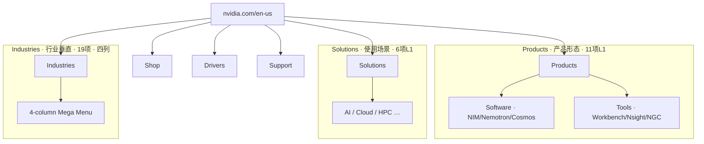
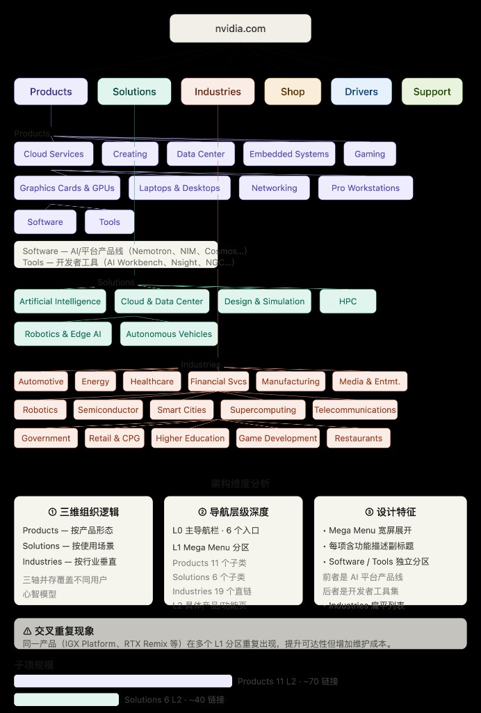
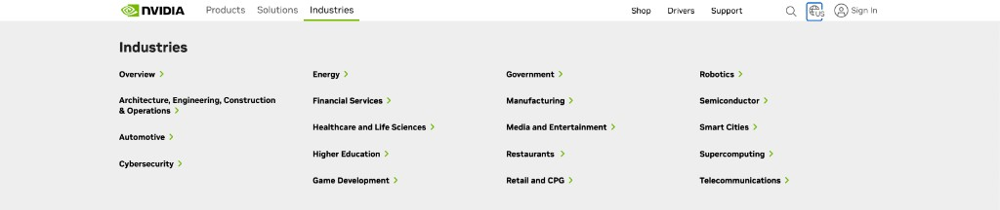

# NVIDIA 主站导航信息架构

> [nvidia.com/en-us](https://www.nvidia.com/en-us/) 顶部 Mega Menu · 域内第二层 IA
>
> **HTML 可视化：** [index.html](./index.html) · 上级文档：[nvidia-site-ia.md](./nvidia-site-ia.md)（跨子域站点层）

## 概述

本文档描述 **主站域内** 的顶部导航信息架构，与 [nvidia-site-ia.md](./nvidia-site-ia.md) 中的 **子站层 IA** 是不同粒度：

| 层级 | 范围 | 组织逻辑 |
|------|------|----------|
| 子站层 | 跨域名：`developer.*`、`docs.*`、`catalog.ngc.*` 等 | 按受众/职能分域，基本互不交叉 |
| **主站导航层（本文）** | `www.nvidia.com` 域内 Mega Menu | **三维矩阵**：Products / Solutions / Industries |

子站层追求 **职能隔离**；主站导航层允许 **交叉重复**（同一产品可从 Products、Solutions、Industries 多路径触达），以提升不同用户心智模型下的可达性。

**对 LLM 信源路由的含义：** 主站 Mega Menu 是 **发现层**（帮助定位「去哪类页面」），不是 **规范层**。技术问答仍应优先路由至 `docs.nvidia.com` / `developer.*`，见 [source-routing-matrix.md](./source-routing-matrix.md)。

---

## L0 导航总览

顶栏共 **6 项** L0 入口：

| L0 入口 | 组织维度 | L1 规模 | 设计特征 |
|---------|----------|---------|----------|
| **Products** | 产品形态 | 11 子类，约 70 链接 | Software / Tools 独立分区 |
| **Solutions** | 使用场景 | 6 子类，约 40 链接 | 场景叙事为主 |
| **Industries** | 行业垂直 | 19 项，四列 Mega Menu | 扁平 L1，每项带 `>` 指示 L2 落地页 |
| **Shop** | 交易 | — | 跳转 `marketplace.nvidia.com` |
| **Drivers** | 支持工具 | — | 驱动下载（终端用户） |
| **Support** | 支持工具 | — | 售后 / 保修入口 |

**导航层级深度：**

- **L0：** 顶栏 6 项
- **L1：** Mega Menu 展开区（Products 11 / Solutions 6 / Industries 19）
- **L2：** 具体产品页、行业落地页、功能页

---

## Products

**组织维度：** 按产品形态（「它是什么」）

**L1 规模：** 11 子类，约 70 链接

**设计特征：**

- 全屏 Mega Menu 展开
- 子项带功能性描述副标题
- **Software** 与 **Tools** 独立分区，区分平台产品线 vs 开发者工具集

### Cloud Services

云服务产品线入口，链至 NVIDIA 云相关托管与 API 产品页。

### Creating

内容创作类产品（创意工具、渲染、视频等）入口。

### Data Center

数据中心 GPU 与平台产品（DGX、HGX 等）选型与概览页。

### Embedded Systems

嵌入式与边缘 AI 平台（Jetson、IGX 等）入口。

### Gaming

GeForce 游戏显卡、Game Ready 驱动入口及相关游戏生态产品。

### Graphics Cards and GPUs

GPU 产品线总览（消费级与专业级显卡选型）。

### Laptops and Desktops

预装 NVIDIA GPU 的笔记本与台式机 OEM 合作伙伴产品入口。

### Networking

网络产品（InfiniBand、以太网、Spectrum 等）入口。

### Pro Workstations

专业工作站 GPU（RTX / NVIDIA RTX Ada 等）入口。

### Software

**平台产品线分区** — AI 平台级产品，非开发者工具：

| 示例子项 | 主站角色 | 出站子域 |
|----------|----------|----------|
| Nemotron | 产品营销 / 选型 | `docs.nvidia.com`（模型文档） |
| NIM | 产品营销 / 选型 | `build.nvidia.com`（试用）、`docs.nvidia.com/nim/`（集成） |
| Cosmos | 产品营销 / 选型 | `docs.nvidia.com` |

### Tools

**开发者工具集分区** — 主站内的开发者入口，实际交付多出站至子域：

| 示例子项 | 主站角色 | 出站子域 |
|----------|----------|----------|
| AI Workbench | 工具概览 | `developer.nvidia.com` |
| Nsight | 工具概览 | `docs.nvidia.com`（Nsight 文档） |
| NGC | 工具概览 | `catalog.ngc.nvidia.com` |

---

## Solutions

**组织维度：** 按使用场景（「它能做什么」）

**L1 规模：** 6 子类，约 40 链接

**设计特征：** 场景叙事为主，每项下链至相关产品线组合页。

### Artificial Intelligence

AI 训练、推理、生成式 AI 等场景解决方案入口。

### Cloud and Data Center

云与数据中心部署场景（私有云、公有云、混合云）。

### Design and Simulation

设计与仿真（CAE、CAD、数字孪生等）场景入口。

### HPC

高性能计算场景（科学计算、天气预报、分子动力学等）。

### Robotics and Edge AI

机器人与边缘 AI 场景入口。与 Industries → Robotics 存在 **交叉重复**。

### Autonomous Vehicles

自动驾驶与智能汽车场景（DRIVE 平台等）入口。

---

## Industries

**组织维度：** 按行业垂直（「谁在用」）

**L1 规模：** 19 项

**布局：** 四列等宽 Mega Menu；每项右侧带绿色 `>` 箭头，表示点击进入该行业 L2 落地页。

**核验来源：** [nvidia.com/en-us](https://www.nvidia.com/en-us/) 顶部导航 → Industries 展开态（2026-06-15 截图）

**设计特征：**

- 无 L1 折叠层级，纯行业名列表
- 不分组副标题（与 Products 的 Software/Tools 分区不同）
- 首项 **Overview** 为 Industries 区块总览入口

### Col 1

| # | L1 菜单项 |
|---|----------|
| 1 | Overview |
| 2 | Architecture, Engineering, Construction & Operations |
| 3 | Automotive |
| 4 | Cybersecurity |

### Col 2

| # | L1 菜单项 |
|---|----------|
| 5 | Energy |
| 6 | Financial Services |
| 7 | Healthcare and Life Sciences |
| 8 | Higher Education |
| 9 | Game Development |

### Col 3

| # | L1 菜单项 |
|---|----------|
| 10 | Government |
| 11 | Manufacturing |
| 12 | Media and Entertainment |
| 13 | Restaurants |
| 14 | Retail and CPG |

### Col 4

| # | L1 菜单项 |
|---|----------|
| 15 | Robotics |
| 16 | Semiconductor |
| 17 | Smart Cities |
| 18 | Supercomputing |
| 19 | Telecommunications |

**与初版 IA 总图的差异：**

| 变更 | 说明 |
|------|------|
| 新增 Overview | Industries 区块索引入口 |
| 新增 AECO | Architecture, Engineering, Construction & Operations |
| 新增 Cybersecurity | — |
| 名称规范化 | Financial Svcs → Financial Services；Healthcare → Healthcare and Life Sciences；等 |

---

## Shop

**L0 职能：** 交易入口

**行为：** 跳转至 `marketplace.nvidia.com`（NVIDIA 商城）

**与子域关系：** 主站 Shop 为 CTA，实际购买在 Marketplace 子域完成。

---

## Drivers

**L0 职能：** 驱动下载（终端用户）

**行为：** 链至 GeForce / NVIDIA 驱动下载页

**与子域关系：** 域内支持路径；非 `developer.*` / `docs.*` 技术文档入口。

---

## Support

**L0 职能：** 售后与保修

**行为：** 链至支持门户、保修查询等

**与子域关系：** 域内或独立支持路径；面向终端用户，非开发者文档。

---

## 三维组织逻辑

主站 Mega Menu 采用 **三条并行轴线**，对应不同用户心智模型：

| 轴线 | 问题 | 代表 L0 |
|------|------|---------|
| 产品形态 | 它是什么？ | Products |
| 使用场景 | 它能做什么？ | Solutions |
| 行业垂直 | 谁在用？ | Industries |

Shop / Drivers / Support 为 **工具型 L0**，不参与三维矩阵，直接服务特定用户意图（购买、下载驱动、获取支持）。

---

## 交叉重复现象

同一产品或主题可 **同时出现在多个 L1 区块**，这是主站的刻意设计：

| 示例 | 出现位置 | 目的 |
|------|----------|------|
| IGX Platform | Products → Embedded；Solutions → Robotics & Edge AI | 按形态 vs 按场景双路径触达 |
| RTX Remix | Products → Gaming；Products → Tools | 产品 vs 工具双归类 |
| Robotics | Industries → Robotics；Solutions → Robotics & Edge AI | 按行业 vs 按场景双路径 |

**代价：** 维护 overhead 增加（同一产品页需多处更新链接与描述）。

**与子站层对比：** 子站按职能分域、基本不交叉；主站按可达性多路径重复。二者互补而非矛盾。

---

## 主站入口 → 子域出站

| 主站导航路径 | 主站角色 | 出站子域 |
|--------------|----------|----------|
| Products → Software → NIM | 产品营销页 | `build.nvidia.com`（试用）、`docs.nvidia.com/nim/`（集成） |
| Products → Tools → NGC | 工具概览 | `catalog.ngc.nvidia.com` |
| Products → Tools → Nsight | 工具概览 | `docs.nvidia.com`（Nsight 文档） |
| Shop | 购买 CTA | `marketplace.nvidia.com` |
| Solutions → AI / Industries → Healthcare 等 | 场景/行业叙事 | 深链至产品页；技术细节出站至 `docs.*` / `developer.*` |
| Drivers / Support | 终端用户支持 | 域内，非 developer/docs |

**LLM 路由规则：** 从主站任意路径进入后，涉及 API、安装、报错等技术问题时，仍应将 `docs.nvidia.com` 作为权威源，`blogs.*` / 主站营销页作为低优先级背景。

---

## 参考图

### 全站 IA 总图（Products / Solutions / Industries 结构）

### Industries Mega Menu 截图（2026-06-15 核验）

---

## 相关文档

- [nvidia-site-ia.md](./nvidia-site-ia.md) — 跨子域站点层 IA
- [design-principles.md](./design-principles.md) — 可迁移 IA 设计原则
- [source-routing-matrix.md](./source-routing-matrix.md) — 按 L2 任务的信源路由表
- [nvidia-site-map.mmd](./nvidia-site-map.mmd) — 子站关系 Mermaid 图
